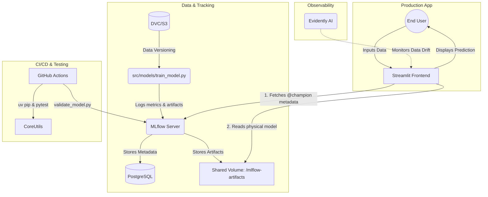

<div align="center">
  
  <h1>🚀 DS-NextGen Banking AI: Motor Predictivo Avanzado de Conversión</h1>
  <h3><em>Enterprise MLOps System & Explainable AI (v2.0)</em></h3>
</div>

<p align="center">
  
  
  
  
  
  
  
</p>

<p align="center">
  <b>Un motor de clasificación End-to-End diseñado para transformar datos crudos en decisiones de negocio rentables. Impulsado por el ciclo CRISP-DM, orquestado con Podman y potenciado por velocidades de instalación en Rust (uv).</b>
</p>

<div align="center">
  
</div>

<br>

## 🎯 Objetivos Estratégicos del Proyecto

Este ecosistema no es solo un modelo estadístico, es una herramienta diseñada para impactar el negocio bancario:

1. 📈 **Optimización del ROI (Call Center):** Maximizar la eficiencia de las campañas de telemarketing dirigiendo los esfuerzos únicamente a clientes con alta propensión a la conversión.
2. 🔍 **Transparencia Regulatoria (Explainable AI):** Desmitificar la "caja negra" del Machine Learning. Usando **SHAP**, proporcionamos explicaciones visuales en tiempo real de por qué se tomó cada decisión, cumpliendo con normativas de riesgo.
3. ⚡ **Velocidad y Escalabilidad (MLOps):** Sustituir flujos de trabajo en Notebooks por una arquitectura de microservicios. Utilizando **Podman Compose**, **MLflow** y el gestor de paquetes ultra rápido **uv**, reducimos el tiempo de despliegue de horas a segundos.
4. 🛡️ **Gobernanza y Confiabilidad:** Asegurar calidad continua mediante integración continua (GitHub Actions), versionado de datos (**DVC**) y un sólido pipeline de pruebas (**pytest**).

---

## 💡 Stack Tecnológico y Arquitectura MLOps (Senior Level)

Este repositorio demuestra ingeniería de Machine Learning a nivel de producción, adoptando las mejores prácticas de la industria y un enfoque *Cloud-Native*.

**Core & Orquestación:**
- 🐋 **Podman & Podman Compose**: Containerización daemonless para mayor seguridad y orquestación de la arquitectura de microservicios (Backend, Tracking Server y Frontend).
- 🚀 **uv**: Gestor de dependencias de ultra alto rendimiento escrito en Rust, logrando resoluciones e instalaciones de paquetes hasta 100x más rápidas que pip tradicional.

**Machine Learning & Data Engineering:**
- 🧠 **MLflow (v2.21+)**: Registro centralizado de modelos, *experiment tracking*, y versionado de artefactos. Uso avanzado de alias de modelos (`@champion`) para inferencias en caliente y CI/CD.
- 🐍 **Python 3.12+**: Aprovechando las últimas características de tipado estricto y optimizaciones de rendimiento del lenguaje.
- 📦 **DVC (Data Version Control)**: Versionado de datos inmutables integrado directamente en el ciclo de vida del control de versiones.

**Frontend & Observabilidad:**
- 🎨 **Streamlit**: Interfaces de usuario analíticas e interactivas para inferencia y consumo en tiempo real.
- 📊 **SHAP (Explainable AI)**: Interpretación de la "caja negra" mediante valores de Shapley, garantizando explicabilidad algorítmica ante auditorías y reguladores bancarios.
- 🕵️ **Evidently AI**: Detección temprana de *Data Drift* y degradación de rendimiento de los modelos en producción.

**Ingeniería de Software y Calidad:**
- 🧪 **Pytest**: Batería de pruebas automatizadas garantizando la validación de transformadores de datos y pipelines de inferencia.
- 🔄 **GitHub Actions**: Integración continua (CI) para la ejecución automatizada de *Quality Gates* en cada PR.

---

## 🏗️ System Architecture

The project leverages a decoupled microservices architecture via Podman Compose, separating the frontend interface, the experiment tracker, and the metadata database.



---

## 🚀 Quickstart

You can run the environment natively using Python tools or fully containerized via Podman Compose.

### Option A: Local Environment (Make)
1. **Clone the repository:**
   ```bash
   git clone https://github.com/gurezende/CRISP-DM-Classification.git
   cd CRISP-DM-Classification
   ```
2. **Install UV and project dependencies:**
   *(The project leverages `uv` for 10-100x faster package installations)*
   ```bash
   pip install uv
   make install
   ```
3. **Fetch Data:**
   ```bash
   make data
   ```
3. **Train the Model:** *(Make sure a local mlflow server is running `mlflow server`)*
   ```bash
   make train
   ```
4. **Run the Application:**
   ```bash
   make app
   ```

### Option B: Podman Compose (Recommended)
Launch the entire MLOps infrastructure (PostgreSQL, MLflow Server, and Streamlit) with a single command (requires Podman Compose):
```bash
make compose-up
```
- **Streamlit App:** [http://localhost:8501](http://localhost:8501)
- **MLflow UI:** [http://localhost:5000](http://localhost:5000)

---

## 📖 API Documentation & Schema

The underlying predictive model expects a specific schema. The Streamlit application handles validation, but if you query the MLflow PyFunc model directly, ensure your payload matches the following format:

### Input Schema (`pandas.DataFrame`)

| Feature | Type | Valid Range / Categories | Description |
|---|---|---|---|
| `default` | Categorical | `yes`, `no` | Has credit in default? |
| `housing` | Categorical | `yes`, `no` | Has housing loan? |
| `loan` | Categorical | `yes`, `no` | Has personal loan? |
| `contact` | Categorical | `cellular`, `telephone` | Contact communication type. |
| `month` | Categorical | `jan` to `dec` | Last contact month of year. |
| `day` | Numeric | `1` - `31` | Last contact day of the month. |
| `campaign` | Numeric | `1` - `50` | Number of contacts performed during this campaign. |
| `pdays` | Numeric | `0` - `100` | Days passed after the client was last contacted (-1 implies no contact). |

### Example MLflow Inference Payload
```python
import mlflow
import pandas as pd

model = mlflow.pyfunc.load_model("models:/term-deposit-predictor@champion")
payload = pd.DataFrame([{
    "default": "no", "housing": "no", "loan": "no", "contact": "cellular", 
    "month": "may", "day": 15, "campaign": 2, "pdays": -1
}])
prediction = model.predict(payload)
print(f"Prediction Probability: {prediction[0][1]}")
```

---

## 📂 Project Structure

```text
├── data
│   ├── external       <- Data from third party sources.
│   ├── processed      <- Canonical data sets for modeling.
│   └── raw            <- Original immutable data (Tracked by DVC).
├── scripts            <- CI/CD Gates and Monitoring scripts (Evidently AI).
├── tests              <- Pytest suites for custom pipeline transformers.
├── podman-compose.yml <- Architecture orchestration.
├── Makefile           <- Automation commands.
├── src/crispdm        <- Source code for use in this project.
│   ├── app            <- Streamlit application.
│   ├── data           <- Data generation/fetching.
│   ├── features       <- Feature engineering (Feature-engine).
│   ├── models         <- MLflow training routines.
│   └── utils          <- Pydantic configuration settings.
```

---

## 🤝 Contributing Guidelines

We welcome contributions! To ensure a smooth process:
1. **Fork the repository** and create a feature branch (`git checkout -b feature/AmazingFeature`).
2. **Follow CCDS:** Keep data scripts in `src/data`, feature engineering in `src/features`, etc.
3. **Testing:** Write unit tests for new features inside the `/tests` folder.
4. **Code Quality:** Ensure your code passes standard checks. Run `make format` and `make lint` before pushing.
5. **Commit & Push:** Commit your changes (`git commit -m 'Add some AmazingFeature'`) and push to the branch (`git push origin feature/AmazingFeature`).
6. **Pull Request:** Open a Pull Request targeting the `main` branch. CI/CD GitHub Actions will automatically evaluate your proposed model against production metrics.

---


## 💬 Punto de Retroalimentación

¡La mejora continua es clave en la ingeniería de software y el Machine Learning! Si tienes comentarios, sugerencias de optimización a nivel de código o arquitectura, o simplemente deseas discutir mejores prácticas:

- **Issues / PRs**: Si encuentras algún área de mejora, siéntete libre de abrir un *Issue* o enviar un *Pull Request* directamente en este repositorio.
- **Contacto**: Conéctate conmigo para discutir colaboraciones, dudas sobre las decisiones técnicas o feedback general sobre el ecosistema predictivo.

*Toda retroalimentación constructiva es fundamental para seguir evolucionando este proyecto.*

---

## 📜 Citations and License

**License:** Distributed under the [MIT License](LICENSE).

**Dataset Reference:**
The dataset used in this project is the **Bank Marketing Dataset**, sourced from the UCI Machine Learning Repository.
* Moro, S., Cortez, P., and Rita, P. (2014). *A Data-Driven Approach to Predict the Success of Bank Telemarketing.* Decision Support Systems, Elsevier, 62:22-31. 
* Available at: [UCI Machine Learning Repository](http://archive.ics.uci.edu/ml/datasets/Bank+Marketing)

**Original Project:**
Developed by Gustavo R Santos.
* Full CRISP-DM post: [Medium - How I Created a Data Science Project Following CRISP-DM Lifecycle](https://towardsdatascience.com/how-i-created-a-data-science-project-following-a-crisp-dm-lifecycle-8c0f5f89bba1?sk=f52e756c664f40ad267fd54b114ab901)
* *V2.0 Senior MLOps enhancements and engineering by Guillén Concepción.*

# 👨‍💻 Credenciales del Autor
**Guillen Concepción**  
*Senior Data Scientist & MLOps Engineer*

Experto en el diseño, desarrollo y despliegue de soluciones integrales de Inteligencia Artificial. Con un enfoque pragmático centrado en el valor de negocio, me especializo en llevar proyectos desde la fase de investigación (CRISP-DM) hasta sistemas de producción escalables, resilientes y auditables. Todo esto impulsado por arquitecturas Cloud-Native y prácticas MLOps de vanguardia.

**Conecta conmigo:**
- 💼 **LinkedIn:** [linkedin.com/in/guillen-concepcion-25266b127](https://www.linkedin.com/in/guillen-concepcion-25266b127)
- 🐙 **GitHub:** [@GuillenConcepcion](https://github.com/GuillenConcepcion)
- ✉️ **Email:** [guillenconcepcion@gmail.com](mailto:guillenconcepcion@gmail.com)